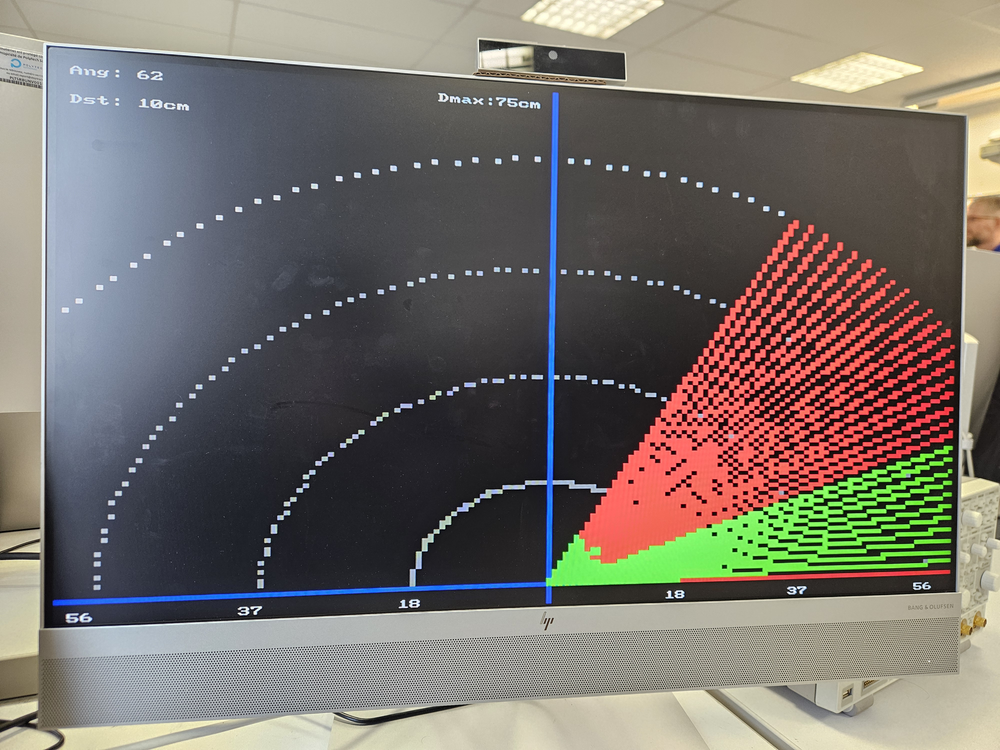

# FPGA-Ultrasonic-2D-Radar

<p align="center">
  
</p>

🎥 **Démonstration vidéo** : [Voir la vidéo](https://drive.google.com/file/d/1671gZXqpNOm7ePOeZDkDI1RWoT3RkAhV/view?usp=sharing)

Ce dépôt présente la conception et la réalisation d’un **radar ultrason 2D** basé sur une architecture **SoC-FPGA**, développé sur la carte **DE10-Lite** autour du processeur **Nios II**.  
Le projet a été réalisé dans le cadre de la formation **Polytech Sorbonne**.

Le système combine :
- un **télémètre ultrason HC-SR04** pour la mesure de distance ;
- un **servomoteur** pour le balayage angulaire sur 180° ;
- un **affichage VGA** de type radar 2D ;
- une **interface UART** permettant la configuration et le contrôle du radar depuis un PC.

Les paramètres du radar (plage angulaire, pas, portée maximale) sont configurables dynamiquement via UART, sans recompiler le code. Le lancement du radar s’effectue par commande logicielle, tandis que l’arrêt est assuré de manière robuste par une entrée matérielle.

---

## Matériel utilisé

- Carte FPGA **DE10-Lite**
- Capteur ultrason **HC-SR04**
- Servomoteur (plage ~0–180°)
- Écran **VGA**
- Convertisseur **USB–UART**
- Câbles de connexion
- Ordinateur avec port USB

---

## Outils logiciels

- **Intel Quartus Prime Lite 18.1**
- **Nios II Software Build Tools for Eclipse**
- **ModelSim**
- Terminal série (PuTTY, TeraTerm, Minicom, …)

---

## Organisation du dépôt

```text
FPGA-Ultrasonic-2D-Radar
├── IPs
│   ├── Servomoteur_IP
│   ├── Telemetre_IP
│   └── UART_IP
│
├── Projets
│   ├── DE10_Lite_Computer_YD
│   ├── DE10_Lite_Servomoteur_IP
│   ├── DE10_Lite_Telemetre_IP
│   └── DE10_Lite_UART_IP
│
├── Images
├── LICENSE
├── MiniProjet_DE10_Lite_Radar2D_2025.pdf
├── Rapport.pdf
└── README.md
```

### Détail du projet SoC principal

```text
DE10_Lite_Computer_YD
├── qsys_edit
├── Computer_System
├── db
├── incremental_db
└── software
    ├── projet
    ├── projet_bsp
    ├── radar_final
    ├── radar_final_bsp
    ├── servomoteur_switches
    ├── servomoteur_switches_bsp
    ├── telemetre_7seg
    ├── telemetre_7seg_bsp
    ├── telemetre_servomoteur
    ├── telemetre_servomoteur_bsp
    ├── uart
    ├── uart_bsp
    ├── vga_radar
    └── vga_radar_bsp
```

---

## Installation et utilisation

1. Cloner le dépôt :
   ```sh
   git clone https://github.com/matgaldino/FPGA-Ultrasonic-2D-Radar.git
   ```
2. Ouvrir le projet `DE10_Lite_Computer.qpf` dans **Quartus 18.1**.
3. Compiler le projet (si nécessaire) et programmer la carte DE10-Lite.
4. Lancer **Nios II SBT for Eclipse** et importer les projets logiciels.
5. Compiler et exécuter le projet `radar_final`.

---

## Rapport

Le rapport complet du projet est disponible dans ce dépôt :

- `Rapport.pdf`

---

## Auteur

- **Matheus Galdino**  
  Polytech Sorbonne
  📧 matheusgaldino2011@gmail.com

---

## Licence

Ce projet est fourni à des fins pédagogiques et académiques.
